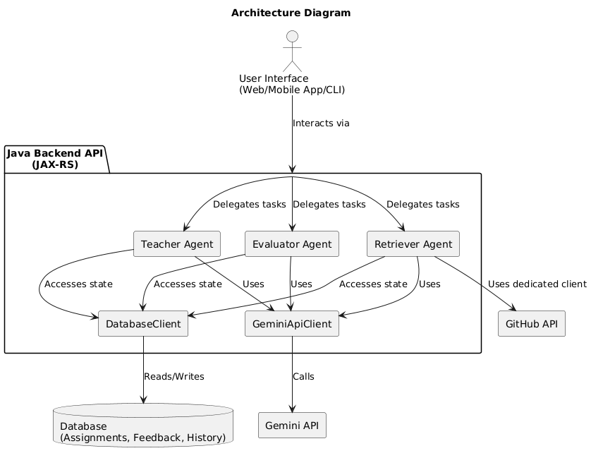

# DSSV-Agent: Technical Documentation

**Project for AI Hackathon**  
**Team:** DSSV  
**Language Category:** Java  

## 1. Introduction  

DSSV-Agent is an AI-powered system designed to automate and personalize the coding assignment lifecycle for educational settings. Built entirely in Java, it leverages AI (specifically Google's Gemini models) to generate assignments, evaluate student submissions against hidden test cases, provide tailored feedback, and facilitate student-teacher interaction via a chatbot interface. The core idea is to create a continuous, feedback-driven loop that adapts to individual student needs while incorporating Human-in-the-Loop (HITL) for teacher oversight and quality control.  

## 2. Architecture  

The system follows a modular, agent-based architecture implemented in Java.  

### **Core Components:**  

1. **Backend API (Java/JAX-RS):**  
    Exposes RESTful endpoints (e.g., `/teacher/v1/...`) built using Java standards (like JAX-RS annotations seen in the example) to handle requests from a potential frontend or testing tools like `curl`. It orchestrates calls to the various agents.  

2. **Teacher Agent (`TeacherAgent.java`):**  
    - Handles assignment creation (solo and group) by coordinating PDF analysis, context retrieval, previous feedback analysis, and calls to the AI generation module.  
    - Manages assignment updates based on teacher feedback (HITL).  
    - Handles multi-turn chat interactions with students (`discuss` method).  
    - Notifies teachers and students.  

3. **Evaluator Agent (`EvaluatorAgent.java`):**  
    - Receives student code submissions.  
    - Fetches corresponding assignment test cases from the database.  
    - Constructs a prompt for the Gemini Code Execution API, instructing it to run the student's code against the tests *as is* and return structured JSON feedback (accuracy, comments, errors).  
    - Parses the AI's response and saves structured feedback to the database.  

4. **Retriever Agent (`BasicRetrieverAgent.java`):**  
    - Performs Retrieval-Augmented Generation (RAG) support.  
    - Extracts keywords from queries or topics.  
    - Uses the GitHub Code Search API (via Java's built-in `java.net.http.HttpClient`) to find relevant code snippets or context based on keywords.  
    - Provides this context to the `TeacherAgent` for assignment generation or potentially chat responses.  

5. **Assignment Generator/Updater (Helper Classes):**  
    Java classes (e.g., `AssignmentGenerator`, `AssignmentUpdater`) encapsulating the logic and prompts for interacting with the Gemini API to generate or modify assignment content (description, starter code, test cases) based on various inputs (topic, PDF analysis, previous feedback, retrieved context).  

6. **Database Client (`DatabaseClient.java` - Interface/Implementation):**  
    A Java interface and its implementation responsible for all interactions with the persistence layer (e.g., storing/retrieving assignments, feedback, conversation history). The specific database technology is abstracted behind this client.  

7. **External Services:**  
    - **Gemini API:** Used for core AI tasks: assignment generation, code evaluation (including execution), feedback generation, and conversational chat. Accessed via a Java client library or direct HTTP calls with a Java HTTP client.  
    - **GitHub API:** Used by the `RetrieverAgent` for fetching relevant code context. Accessed via Java's `HttpClient`.  

### **High-Level Flow (Example: Solo Assignment):**  

1. API receives POST request (`/teacher/v1/create/solo`).  
2. `TeacherAgent.createSoloAssignment` is called.  
3. Agent fetches previous student feedback via `DbClient`.  
4. Agent optionally analyzes provided PDF content using Gemini.  
5. Agent uses `RetrieverAgent` to fetch context based on `topicOfInterest`.  
6. Agent calls `AssignmentGenerator` with student ID, feedback, PDF analysis, context, topic.  
7. `AssignmentGenerator` prompts Gemini to create a personalized assignment (description, starter code, test cases).  
8. `TeacherAgent` receives the generated `Assignment` object.  
9. Agent saves the assignment to the database via `DatabaseClient`.  
10. Agent notifies the teacher (`notifyTeacher` - HITL mechanism, e.g., logs message, sends email/webhook).  
11. API returns the created `Assignment` object as JSON.  

### **(Self-Correction: Add Diagram Description)**  
**Architecture Diagram:**  
  
*Figure 1: High-level architecture of the DSSV-Agent system showcasing core components and their interactions.*

## 3. Setup and Running  

### **Prerequisites:**  

- Java Development Kit (JDK), version 11 or higher recommended.  
- Apache Maven (for building the project).  
- Git (for cloning the repository).  
- Access to Google Gemini API and a GitHub account.  

### **Environment Variables:**  

You **must** set the following environment variables before running the application:  

1. `GEMINI_API_KEY`: Your API key for accessing the Gemini API.  
    - *PowerShell Example:* `$env:GEMINI_API_KEY="YOUR_API_KEY_HERE"`  
    - *Bash Example:* `export GEMINI_API_KEY="YOUR_API_KEY_HERE"`  
2. `GITHUB_TOKEN`: A GitHub Personal Access Token (PAT) with permissions for code search (`search` scope). This is recommended for higher API rate limits. If not provided, the `RetrieverAgent` might face stricter rate limits.  
    - *PowerShell Example:* `$env:GITHUB_TOKEN="YOUR_GITHUB_TOKEN_HERE"`  
    - *Bash Example:* `export GITHUB_TOKEN="YOUR_GITHUB_TOKEN_HERE"`  

### **Build:**  

Navigate to the project's root directory in your terminal and run:  

```bash
mvn clean package
```  

This will compile the code, run any tests (if configured), and package the application into an executable JAR file located in the `target/` directory (e.g., `dssv-agent-1.0-SNAPSHOT.jar`).  

### **Run:**  

Execute the packaged JAR file:  

```bash
java -jar target/dssv-agent-1.0-SNAPSHOT.jar
```  

The backend server should start, typically listening on `http://localhost:8080` (this might be configurable).  

### **Testing (API Examples):**  

#### Create Solo Assignment (Topic-based):  
```bash
curl -X POST http://localhost:8080/teacher/v1/create/solo -F "studentId=student001" -F "topic=Implement Merge Sort in Python"
```  

#### Create Solo Assignment (PDF-based):  
```bash
# Replace 'path/to/your/document.pdf' with the actual file path
curl -X POST http://localhost:8080/teacher/v1/create/solo -F "studentId=student002" -F "pdf=@path/to/your/document.pdf;type=application/pdf"
```  

#### Create Group Assignment:  
```bash
curl -X POST http://localhost:8080/teacher/v1/create/group -F "studentIds=student001" -F "studentIds=student003" -F "topic=Basic REST API with Flask"
```  

#### Submit Assignment:  
```bash
curl -X POST http://localhost:8080/evaluator/v1/evaluate \
      -H "Content-Type: application/json" \
      -d '{"studentId": "student001", "assignmentId": "asgn-xyz", "answer": "def hello():\n  print(\"Hello World\")"}'
```  

#### Discuss Assignment:  
```bash
curl -X POST http://localhost:8080/teacher/v1/discuss \
      -H "Content-Type: application/json" \
      -d '{"studentId": "student001", "assignmentId": "asgn-xyz", "message": "I am having trouble with the base case for recursion."}'
```  

## 4. Codebase Quality & Completeness 

### **Completeness:**  
The repository aims to provide a functional backend system demonstrating the core loop. It includes:  
- Agent implementations (`TeacherAgent`, `EvaluatorAgent`, `RetrieverAgent`).  
- API endpoints (JAX-RS examples shown).  
- Integration with external AI (Gemini) and data source (GitHub) APIs.  
- Database interaction abstraction (`DbClient`).  
- Basic logging (`java.util.logging` shown).  
- Clear build instructions (Maven).  
- This detailed README.  

### **Code Comments & Clarity:**  
The provided snippets include Javadoc comments and inline logging, indicating an effort towards maintainability. Further commenting throughout the codebase is recommended.  

### **Instructions:**  
Setup, build, and run instructions are provided above. `curl` examples demonstrate API usage.  

### **Test Suite:**  
**Self-Correction:** Based on the provided information, a dedicated automated test suite (e.g., using JUnit for unit tests, Mockito for mocking dependencies like `DbClient` or `GeminiClient`, and potentially integration tests for API endpoints) is not explicitly mentioned or provided. Adding unit tests for agent logic, helper classes (parsing, prompt generation), and integration tests for the API endpoints would significantly improve robustness and fulfill this criterion more strongly.  

### **Security Best Practices:**  
- API keys (`GEMINI_API_KEY`, `GITHUB_TOKEN`) are handled via environment variables, which is better than hardcoding.  
- Input validation seems basic (checking for null/blank). Robust validation (e.g., checking formats, lengths, potential injection patterns) should be implemented, especially for student code submissions before sending them to the evaluation environment (even if sandboxed by Gemini).  
- Dependencies should be kept up-to-date (`mvn versions:display-dependency-updates`).  

### **Error Handling:**  
The code shows try-catch blocks and logging, but consistent error handling strategies (e.g., specific exceptions, standardized error responses in the API) are important.  

### **Technical Implementation & Sophistication:**  
The project demonstrates non-trivial technical implementation:  
- Integration with multiple external APIs (Gemini Code Execution, Gemini Chat, GitHub Search).  
- Structured JSON parsing (using Jackson `ObjectMapper`).  
- State management through database interactions.  
- Asynchronous operations (implied by `HttpClient` usage and potential notifications).  
- An agent-based design pattern in Java.  

### **Architecture Diagram:**  
A textual description is provided above. A visual diagram (e.g., using tools like diagrams.net/draw.io or Mermaid syntax) would be beneficial.  

## 5. Alignment with Hackathon Category (Java)  

### **Built with Java:**  
The entire backend logic, agent system, API layer, and external service integrations are implemented purely in Java.  

### **Showcasing Java:**  
- **Object-Oriented Programming:** The project utilizes OOP principles extensively through its Agent-based design (e.g., `TeacherAgent`, `EvaluatorAgent` classes encapsulate responsibilities), helper classes (`AssignmentGenerator`, `DbClient`), and data models (`Assignment`, `Feedback`, `Message`).  
- **Standard Libraries:** Leverages core Java libraries like `java.net.http.HttpClient` for API calls, `java.time` for timestamps, `java.util` collections and streams, `java.util.logging` for logging, and `java.util.UUID` for ID generation.  
- **Java Ecosystem:** Uses standard Java build tools (Maven) and common Java libraries for web services (JAX-RS or similar) and JSON processing (Jackson).  
- **Exception Handling:** Demonstrates Java's exception handling mechanisms.  

### **AI Technology Implementation:**  
AI (specifically the Gemini API) is core to the functionality, not a peripheral feature. It drives:  
- **Content Generation:** Creating assignments and potentially test cases.  
- **Code Evaluation:** Executing student code against tests and generating structured results.  
- **Natural Language Interaction:** Powering the student-teacher agent chat.  
- **Personalization:** Using past feedback (derived from AI evaluation) to tailor future generated content.  

This project substantially utilizes Java's strengths in building robust backend systems and integrates sophisticated AI capabilities as central components.  